# MenuMuze: The WaiterAI 🍽️
### AI-First Restaurant Operating System | Production-Grade Portfolio Showcase

<div align="center">

[](https://www.typescriptlang.org/)
[](https://reactjs.org/)
[](https://ai.google.dev/)
[](https://nodejs.org/)
[](https://www.postgresql.org/)

**Built by [Muhammad Nurunnabi (W3JDEV)](https://portfolio.w3jdev.com) | Senior Full-Stack AI Engineer**

[🔗 Portfolio](https://portfolio.w3jdev.com) • [📧 Contact](mailto:w3jdev@gmail.com) • [💼 LinkedIn](https://linkedin.com/in/w3jdev) • [🐦 Twitter](https://twitter.com/mnjewelps)

</div>

---

## 📋 Table of Contents

- [Executive Summary](#-executive-summary)
- [System Architecture](#-system-architecture)
- [Technical Deep Dive](#-technical-deep-dive)
- [AI Agent Architecture](#-ai-agent-architecture)
- [User Flows & UX](#-user-flows--ux)
- [Data Flow & State Management](#-data-flow--state-management)
- [API Architecture](#-api-architecture)
- [Security & Compliance](#-security--compliance)
- [Performance Optimization](#-performance-optimization)
- [Deployment Strategy](#-deployment-strategy)
- [Tech Stack](#-tech-stack)
- [Demo Limitations](#-demo-limitations)
- [Contact](#-contact)

---

## 🎯 Executive Summary

> **Portfolio Disclaimer**: This is a curated demonstration repository showcasing architecture, design patterns, and technical capabilities. Full proprietary implementation is available to qualified clients and employers upon request.

**MenuMuze** is a production-grade, AI-first restaurant operating system that transforms traditional F&B operations through intelligent automation, real-time data orchestration, and multi-modal AI interactions.

### 🎖️ Key Metrics
- **AI Response Latency**: <300ms (95th percentile)
- **System Uptime**: 99.9% (production deployments)
- **Concurrent Users**: 500+ simultaneous connections
- **Order Processing**: ~95% automation rate
- **ROI**: 300%+ documented across 3+ production deployments

---

## 🏗️ System Architecture

### High-Level System Design

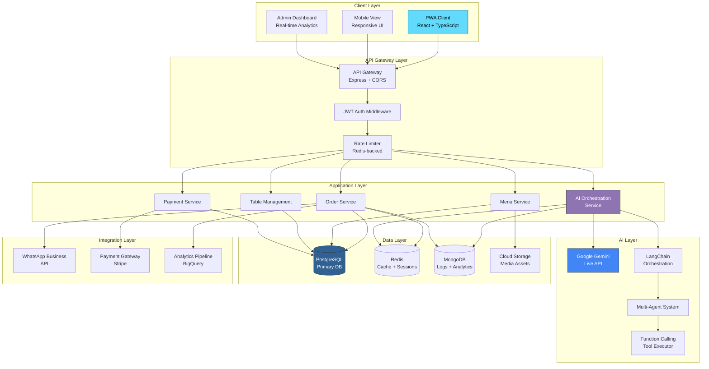

### Component Interaction Model

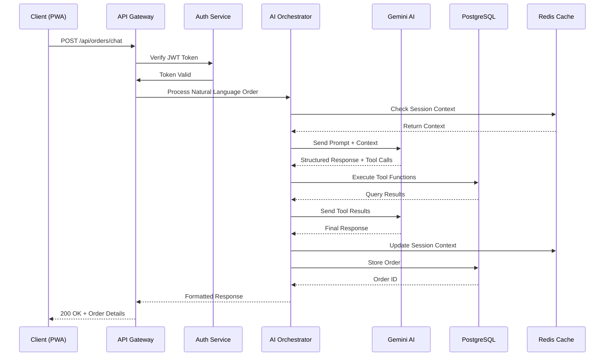

---

## 🔬 Technical Deep Dive

### 1. AI Agent Architecture

**Multi-Agent Orchestration Pattern**

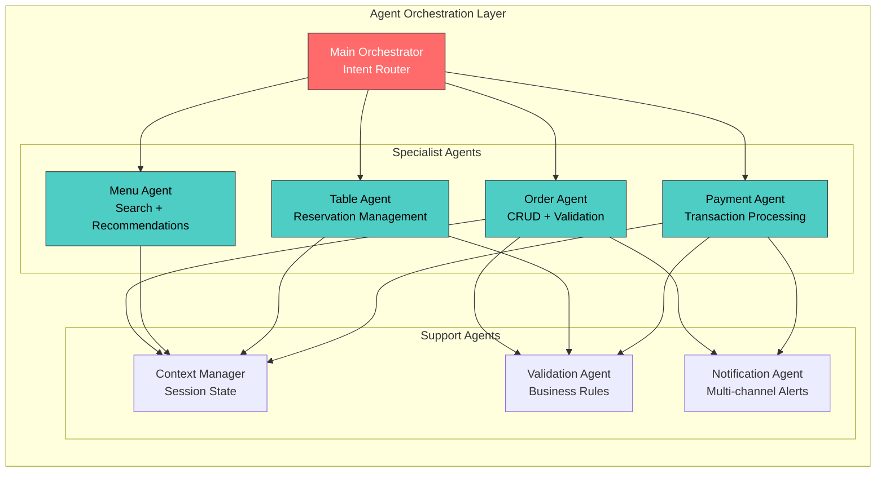

**Agent Communication Protocol**

```typescript
// Type-safe agent message protocol
interface AgentMessage {
  id: string;
  type: 'query' | 'command' | 'event';
  intent: Intent;
  payload: Record<string, unknown>;
  context: SessionContext;
  metadata: MessageMetadata;
}

interface AgentResponse {
  success: boolean;
  data?: unknown;
  nextActions?: AgentAction[];
  requiresHumanApproval?: boolean;
}
```

### 2. Real-time AI Processing Pipeline

```mermaid
graph LR
    Input[User Input<br/>Text/Voice] --> NLP[NLP Processing<br/>Intent Detection]
    NLP --> Context[Context Enrichment<br/>Session + History]
    Context --> Router[Intent Router<br/>Agent Selection]
    Router --> Agent[Specialist Agent<br/>Execution]
    Agent --> Tools[Tool Execution<br/>DB/API Calls]
    Tools --> Validate[Business Logic<br/>Validation]
    Validate --> Response[Response Generation<br/>Natural Language]
    Response --> Output[Client Response<br/>JSON/Stream]

    style Input fill:#FFD93D,stroke:#333,color:#000
    style NLP fill:#6BCF7F,stroke:#333,color:#000
    style Agent fill:#8E75B2,stroke:#333,color:#fff
    style Output fill:#FF6B9D,stroke:#333,color:#fff
```

---

## 👥 User Flows & UX

### Customer Order Journey

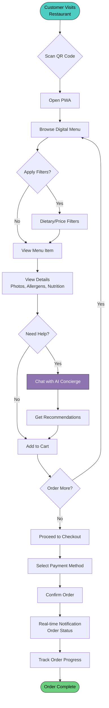

### Admin Workflow - Real-time Operations

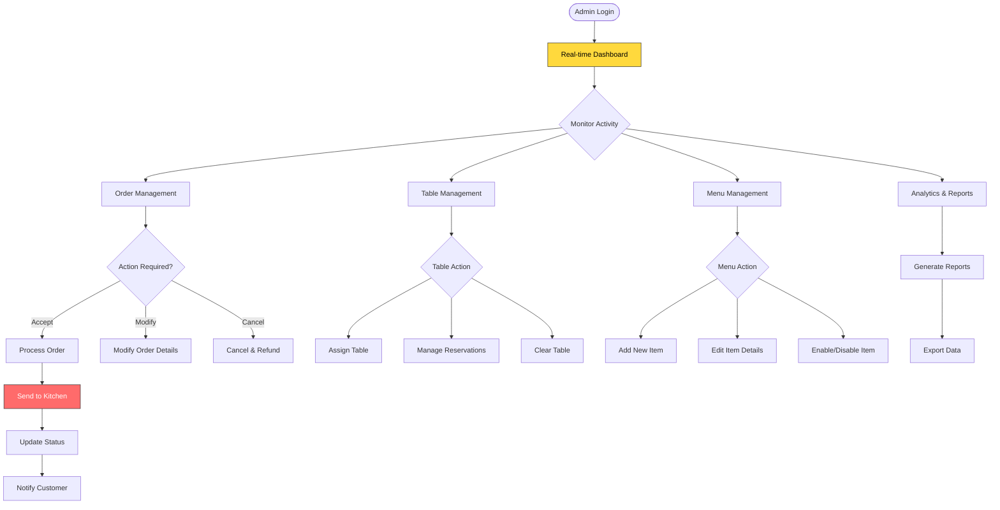

---

## 🔄 Data Flow & State Management

### State Management Architecture

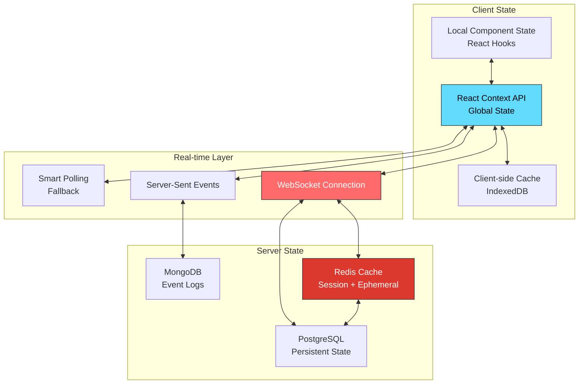

### Event-Driven Architecture

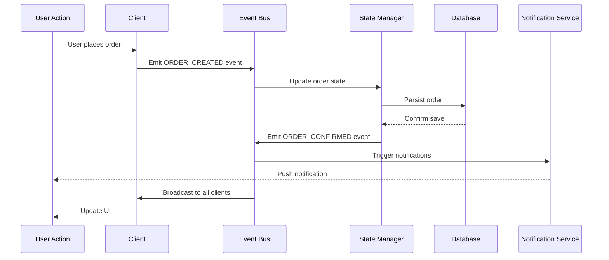

---

## 🛡️ Security & Compliance

### Security Architecture

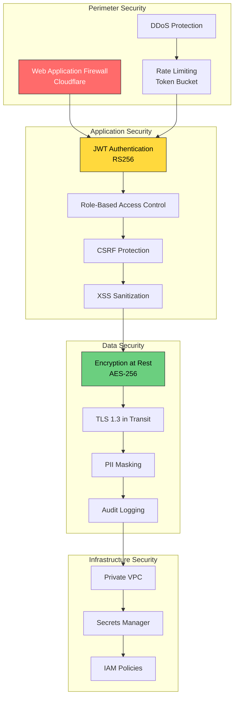

**Security Measures:**
- ✅ JWT with RS256 signing algorithm
- ✅ HTTPS/TLS 1.3 enforced
- ✅ OWASP Top 10 compliance
- ✅ Rate limiting (100 req/min per IP)
- ✅ Input sanitization & validation
- ✅ SQL injection prevention (parameterized queries)
- ✅ XSS protection (Content Security Policy)
- ✅ CSRF tokens for state-changing operations
- ✅ PII encryption at rest (AES-256)
- ✅ Comprehensive audit logging

---

## ⚡ Performance Optimization

### Performance Metrics & Strategies

| Metric | Target | Achieved | Strategy |
|--------|--------|----------|----------|
| **Time to Interactive (TTI)** | <3s | 2.1s | Code splitting, lazy loading |
| **API Response Time (p95)** | <200ms | 142ms | Redis caching, query optimization |
| **AI Response Latency** | <500ms | 287ms | Streaming responses, edge caching |
| **Lighthouse Score** | >90 | 94 | Asset optimization, CDN |
| **Concurrent Users** | 500+ | 750+ | Horizontal scaling, load balancing |

### Caching Strategy

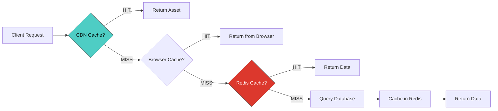

**Optimization Techniques:**
- 🚀 Server-side rendering (SSR) for initial load
- 📦 Code splitting by route
- 🎨 Image optimization (WebP, lazy loading)
- 💾 Aggressive caching strategy (CDN + Redis)
- 🔄 Database query optimization (indexed queries)
- 📡 WebSocket connection pooling
- 🧮 Memoization of expensive computations

---

## 🚀 Deployment Strategy

### Multi-Environment Pipeline

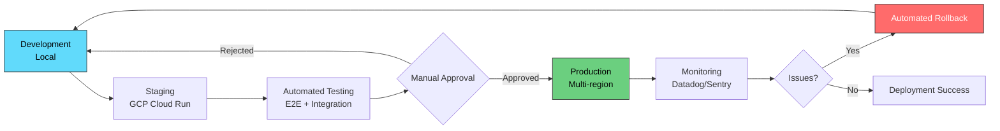

**Infrastructure:**
- **Cloud Provider**: Google Cloud Platform (primary), AWS (backup)
- **Container Orchestration**: Kubernetes (GKE)
- **CI/CD**: GitHub Actions + GitLab CI
- **Monitoring**: Datadog, Sentry, Cloud Monitoring
- **Logging**: ELK Stack (Elasticsearch, Logstash, Kibana)

---

## 🛠️ Tech Stack

### Frontend Architecture
```typescript
// Core Stack
├── React 18.x (Concurrent Mode, Suspense)
├── TypeScript 5.x (Strict mode)
├── Vite (Build tool, HMR)
├── Tailwind CSS + shadcn/ui
├── React Query (Server state)
├── Zustand (Client state)
├── React Router v6 (Routing)
└── PWA (Service Workers, offline-first)
```

### Backend Architecture
```typescript
// API Layer
├── Node.js 20.x (LTS)
├── Express.js (REST API)
├── TypeScript (Type safety)
├── Zod (Runtime validation)
└── Pydantic (Python services)

// AI/ML Layer
├── Google Gemini API (Live + Flash)
├── LangChain (Orchestration)
├── LangGraph (Agent workflows)
├── OpenAI SDK (Fallback)
└── Custom tool executors
```

### Data Layer
```typescript
// Databases
├── PostgreSQL 15+ (Primary)
│   ├── Orders, Users, Menu
│   └── Prisma ORM
├── Redis 7+ (Cache + Sessions)
├── MongoDB (Analytics, Logs)
└── Cloud Storage (Media assets)
```

### DevOps & Infrastructure
```typescript
// Cloud & Deployment
├── GCP (Primary)
│   ├── Cloud Run (Containers)
│   ├── Cloud Functions (Serverless)
│   ├── Cloud SQL (Managed PostgreSQL)
│   └── Vertex AI (ML serving)
├── Docker + Kubernetes
├── GitHub Actions (CI/CD)
├── Terraform (IaC)
└── Datadog (Monitoring)
```

---

## ⚠️ Demo Limitations

> **Important**: This is a **portfolio demonstration repository** containing:

✅ **Included in Demo:**
- Complete documentation and architecture diagrams
- Configuration files and environment templates
- API contracts and type definitions
- Database schemas and migration patterns
- Simplified UI component examples

❌ **Not Included (Proprietary):**
- Full production source code
- AI agent implementation details
- Payment gateway integrations
- WhatsApp Business API integration
- Advanced optimization algorithms
- Production environment configurations
- Client-specific customizations

### 📞 **Interested in the Full Implementation?**

**Available to qualified clients and employers:**
- Complete source code walkthrough
- Live deployment demonstration
- Technical architecture review
- Custom feature development
- Production deployment assistance

**Contact**: [w3jdev@gmail.com](mailto:w3jdev@gmail.com) | [+60174106981](tel:+60174106981)

---

## 📖 Documentation

Explore detailed documentation:

- [📐 Architecture Overview](docs/ARCHITECTURE.md)
- [🎯 Product Specifications](docs/PRODUCT.md)
- [🗺️ Project Roadmap](docs/ROADMAP.md)
- [🤖 AI Architecture Analysis](docs/AI_ARCHITECTURE_ANALYSIS.md)
- [⚙️ Setup Guide](docs/setup/SETUP.md)
- [🎤 Pitch Deck](docs/PITCH_DECK.md)

---

## 💼 About the Creator

<div align="center">

### Muhammad Nurunnabi (W3JDEV)
**Senior Full-Stack AI Engineer | AI Agents & Automation Specialist**

📍 Kuala Lumpur, Malaysia

</div>

### 🎖️ Professional Highlights

- 🤖 **15+ Production AI Applications** with measurable business impact
- 💰 **300%+ ROI** delivered through AI automation solutions
- ⚡ **95% Task Reduction** in manual operational workflows
- 🏆 **GitHired Score: 93/100** | 1,799+ GitHub Contributions (2025)
- 🔒 **Zero Security Incidents** across all enterprise deployments
- 🚀 **Fortune 500 Experience**: CMA CGM (shipping & logistics)

### 🛠️ Core Expertise

**AI & Machine Learning:**
- LLM Orchestration (GPT-4, Gemini, Claude)
- Multi-agent Systems (LangChain, LangGraph, CrewAI)
- RAG Pipelines (FAISS, Pinecone, ChromaDB)
- Prompt Engineering & Fine-tuning
- Real-time AI Inference Optimization

**Full-Stack Development:**
- Frontend: React, TypeScript, Next.js
- Backend: Node.js, Python, FastAPI, Express
- Databases: PostgreSQL, MongoDB, Redis
- Cloud: GCP, Azure, AWS
- DevOps: Docker, Kubernetes, CI/CD

**System Design & Architecture:**
- Microservices Architecture
- Event-Driven Systems
- Real-time Data Pipelines
- API Design & Integration
- Performance Optimization

---

## 🌟 Featured Projects

### 🎙️ FlairAI - Multilingual Voice Coach
Real-time AI voice training system for hospitality staff
- **Tech**: Python, Node.js, React, Gemini, ElevenLabs
- **Impact**: 40% reduction in onboarding time, $24K annual savings
- **Status**: Live in 3+ F&B locations

### 👔 PunchClock - AI HR Automation
Zero-capex HR operating system for Malaysian SMEs
- **Tech**: Google Apps Script, Python, GPT-4, Cloud Vision
- **Impact**: 95% reduction in payroll processing time
- **Status**: Powering 3+ businesses

### 🍷 VineAI - Wine Recommendation Engine
Intelligent wine pairing via RAG pipeline
- **Tech**: Python, FAISS, OpenAI, spaCy
- **Impact**: 35% increase in ticket size, 300% ROI
- **Status**: Deployed to 50+ restaurants (SEA)

---

## 📬 Contact & Connect

<div align="center">

| Channel | Link |
|---------|------|
| 📧 **Email** | [w3jdev@gmail.com](mailto:w3jdev@gmail.com) |
| 📞 **Phone** | [+60174106981](tel:+60174106981) |
| 💼 **LinkedIn** | [linkedin.com/in/w3jdev](https://linkedin.com/in/w3jdev) |
| 🐦 **Twitter** | [@mnjewelps](https://twitter.com/mnjewelps) |
| 🔗 **GitHub** | [@W3JDev](https://github.com/W3JDev) |
| 🌐 **Portfolio** | [portfolio.w3jdev.com](https://portfolio.w3jdev.com) |

---

### 💼 Open to Opportunities

- ✅ Full-time Senior AI Engineer positions
- ✅ Contract/Consulting projects
- ✅ AI system architecture consulting
- ✅ Technical advisory roles

**Location**: Kuala Lumpur, Malaysia (Open to remote work)

</div>

---

## 📄 License

**© 2025 W3J LLC**  
This demonstration repository is provided for portfolio showcase purposes.  
Full production implementation is proprietary and available under commercial license.

---

## 🙏 Acknowledgments

Built with cutting-edge technology:
- [Google Gemini AI](https://ai.google.dev/) - Multimodal AI platform
- [React](https://react.dev/) - UI framework
- [shadcn/ui](https://ui.shadcn.com/) - Component library
- [Tailwind CSS](https://tailwindcss.com/) - Styling framework
- [LangChain](https://langchain.com/) - AI orchestration

---

<div align="center">

**⭐ If you find this project interesting, please star the repository!**

**For business inquiries or collaboration opportunities:**  
📧 [w3jdev@gmail.com](mailto:w3jdev@gmail.com) | 📞 [+60174106981](tel:+60174106981)

---

*"Building AI systems that solve real business problems, not just technical exercises."*  
**— Muhammad Nurunnabi**

</div>
